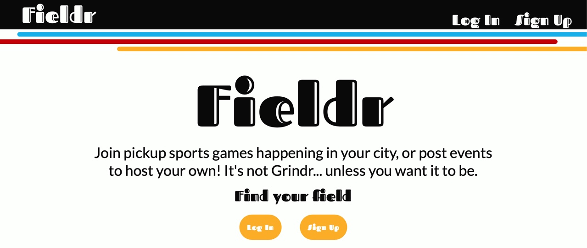
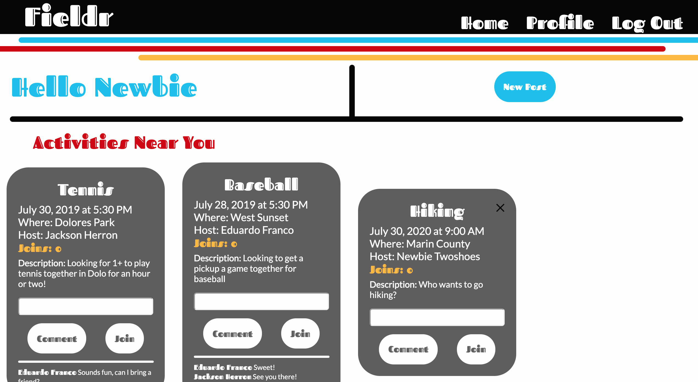
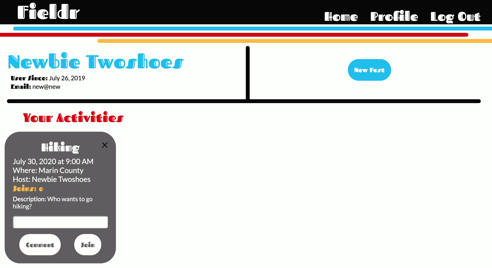

# Fieldr
Fieldr is a web application that helps you find friends to play sports with. You can post about events you are hosting, or find people in your area looking to get a game together. Comment on posts and join them to let others know you will be there.

## Heroku Deployment

https://fieldr-app.herokuapp.com/

--- 

### Technologies Used:

- Javascript
- Node.js
- Express
- Mongoose
- MongoDB
- bcrypt
- jQuery + AJAX
- HTML
- CSS

--- 

### User Story

1. Create an account
2. Log in
3. From the home page, view posts happening in your area
4. Post about your own outings as well
5. View all posts you are connected to from your profile pag

--- 

### Screenshots

--- 

### Team

- Jackson Herron
- Eduardo Franco

